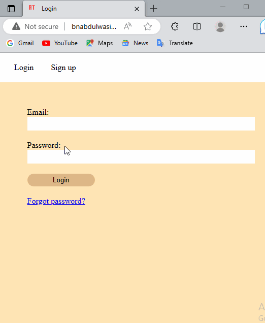

# Myshare
 A resource sharing app

<h1>Resources sharing app (HTML, CSS, JavaScript, Flask, Python):</h1
                                                                  
<ul>
 <li>Developed a Full stack application that allows users in an institution to share links to files, videos and lots
more.</li>
 <li>Allows students to share resources without having a physical connection to each other.</li>
<li>Allows students to create, update their personal profiles.</li>
<li>Allows students to create, update and delete their posts.</li>
<li>Also worked on a feature that made users reset their password if they have signed up on the website</li>
<li>Worked on rendering all the posts made by specific users to make information to users readily available</li>
</ul>

<h1>App walkthrough</h1>

<a href="https://bnabdulwasiu.pythonanywhere.com">Click to view project live deployment</a>
